# 一、数据可视化

图片在experiments/notes/image目录下的各个文件夹下

1.饼图，盒图，直方图，散点图，已经数据降维到3维后的3d分布图。

2.将0类和1类数据分开，做图对比，观察区别。但是并没有什么发现。

# 二、数据特征

### 1.features的数据类型分为两类

##### 布尔

```
'users_3w',
'twolow_users', 
'roam_users02', 
'roam_users01',
'vv_type',
'in16_roam_tag'
```

##### 数值

```
'roam_call_duration',
'roam_duration_02',
'mon_use_days',
'is_p_app_wx_times', 
'zhujiao_time', 
'zhujiao_times',
'mb5',
'mb10',
'mb30', 
'mb60', 
'ma60', 
'total_count',
'beijiao_times', 
'use_days', 
'zhujiao', 
'beijiao',
'zhujiao_jt', 
'open', 
'close', 
'open_day', 
'cell_num'
```

### 2.数据极度不平衡

##### 总体情况

label==0 : 299335

label==1: 221

label ==1 vs all : 0.0007 vs 1

##### 解决办法

- under sampling
- over sampling
- cost sensitive
- anomaly detection
- 如图


### 3.对于数值型特征，数据在低处十分密集。正类、负类的分布差别很小。

### 4.布尔型特征分布情况如下。对于所有特征，特征值为0的比例非常高。正类、负类的分布差别很小。

```
				users_3w      
label       	0     1             
0         251796  47539
1            214      7
############################
				twolow_users       
label              0      1        
0             279117  20218
1                214      7
############################
				roam_users02       
label              0     1       
0             294261  5074
1                197    24
############################
				roam_users01       
label              0      1        
0             288157  11178
1                186     35
############################
				vv_type       
label         0      1        
0        259488  39847
1           196     25
############################
				in16_roam_tag      
label                0      1        
0              276510  22825
1                 217      4
############################
```

# 三、降维

### 特征选择

###### 1.移除低方差特征

移除那些在整个数据集中特征值为0或者为1的比例超过80%的特征后，只剩下数值型特征。


### 特征提取

###### 1. PCA

保留99%的variance的情况下，数据可以降到3维

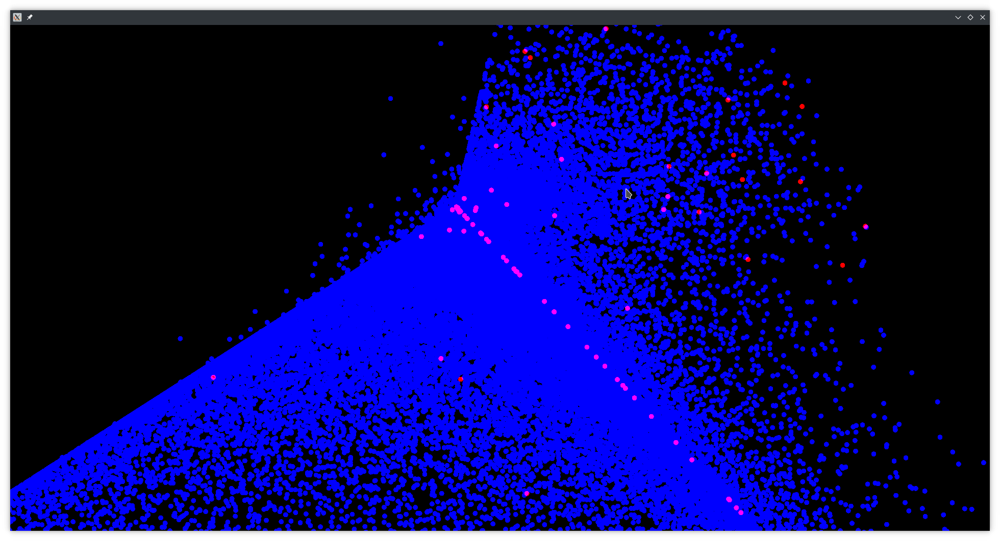

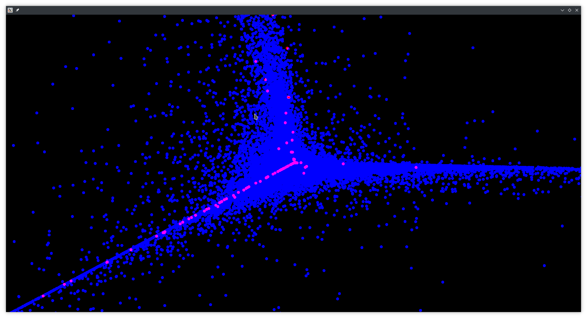

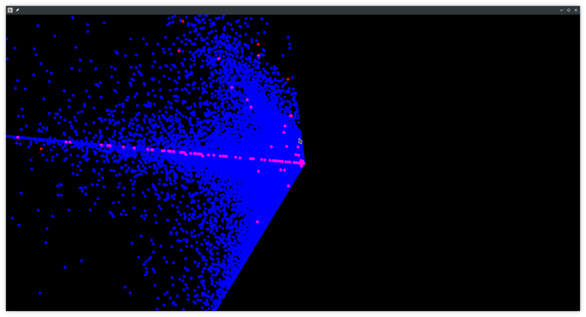

# 四、处理imbalanced data

### 总结：

#### 1.采用kfold交叉验证：

​			使用上采样算法得到的fscore值只有0.66;

​			使用下采样算法，数据由3万条变成400条;

​			将两者结合的算法有：SMOTETomek和SMOTEENN，但是耗时非常长。


#### 2.使用某月的数据做训练集，另一月数据做测试集，使用随机上采样和sgd classifier：

​			在训练集上的表现：

	"precision": 0.8041243531380102,
	"recall": 0.3446982964230555,
	"f1_score": 0.48254670944182154


​	
​	"true_pos": 103334,
​	"true_neg": 274262,
​	"false_pos": 25519,
​	"false_neg": 196447
​		模型把很多1类预测成了0类。			

​		在测试集上的表现：

```
"precision": 0.0026360952838607814,
"recall": 0.8067226890756303,
"f1_score": 0.005255018953649091


"true_pos": 190,
"true_neg": 228466,
"false_pos": 71299,
"false_neg": 48
```

​		模型把很多0类预测成了1类。会出现这种差别，是因为我对训练集进行了上采样，没有对测试集做上采样。

​		将阈值从默认的0.5调整为其他数值，数值调高，false negative会变得很高，数值调低，false positive 会很高。不能找到一个平衡。


roc曲线：

​    训练集：

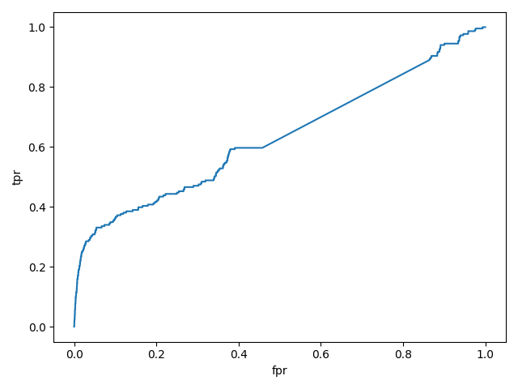

auc：0.63

​    测试集：

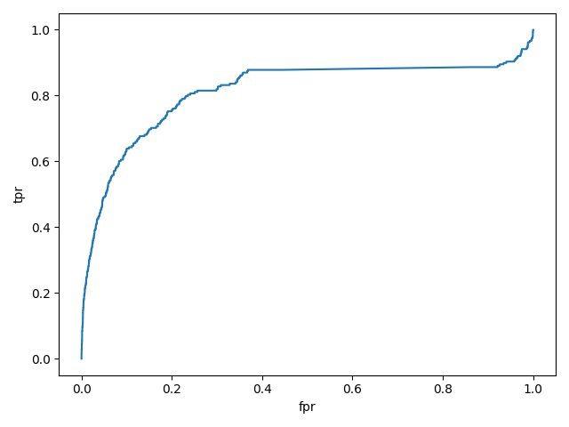

auc：0.81

#### 3.代价敏感学习

调整sklearn模型的class_weight参数，但是效果也不是很好。


以下是一些试验的记录

##### sgd classifier，class_weight={0: 80, 1: 920}，k_fold = KFold(n_splits=5, shuffle=True)

一、上采样

1.随机上采样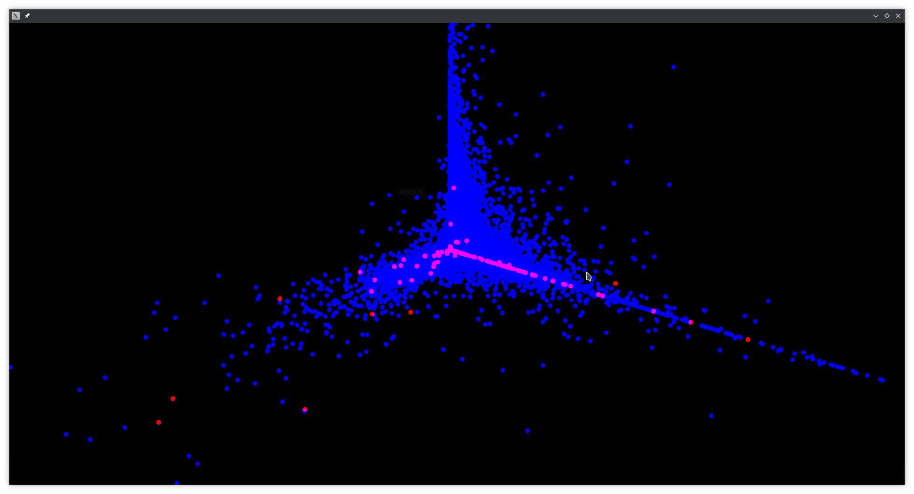


```
{
    "precision": 0.5003343475208132,
    "recall": 1.0,
    "f1_score": 0.6669637982328102
}
{
    "precision": 0.5011449133137063,
    "recall": 0.9959161902221926,
    "f1_score": 0.6667708240335685
}
{
    "precision": 0.5025460504862163,
    "recall": 1.0,
    "f1_score": 0.6689259877573734
}
{
    "precision": 0.500822183083896,
    "recall": 1.0,
    "f1_score": 0.6673970957103051
}
{
    "precision": 0.5001797493541564,
    "recall": 1.0,
    "f1_score": 0.6668264247260892
}
```

2. SMOTE

   kind = regular

   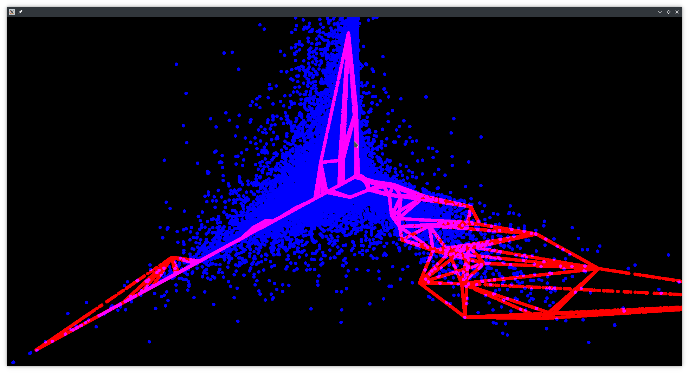

```
{
    "precision": 0.5038632226239713,
    "recall": 0.9981884660129633,
    "f1_score": 0.6696846201448394
}
{
    "precision": 0.5012154603187955,
    "recall": 0.9974055103612199,
    "f1_score": 0.6671667776987802
}
{
    "precision": 0.5024898220113724,
    "recall": 0.9969127046376183,
    "f1_score": 0.6681841314937335
}
{
    "precision": 0.5015323206934273,
    "recall": 1.0,
    "f1_score": 0.6680273395138282
}
{
    "precision": 0.5001294460544008,
    "recall": 1.0,
    "f1_score": 0.6667817198973429
}
```


3. ADASYN

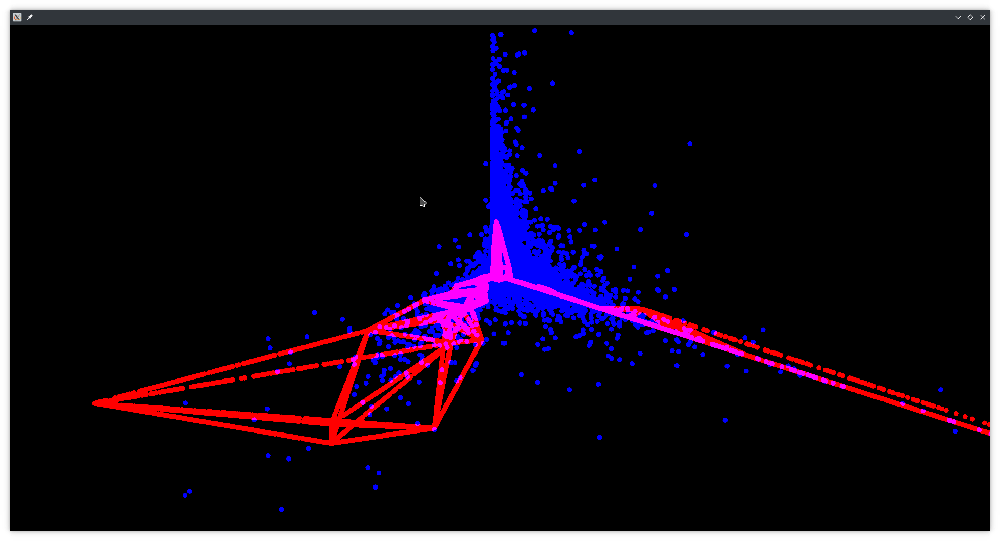

```
{
    "precision": 0.5027217446005452,
    "recall": 0.9988001799730041,
    "f1_score": 0.6688128368501512
}
{
    "precision": 0.5003465582176052,
    "recall": 1.0,
    "f1_score": 0.6669746472601787
}
{
    "precision": 0.4999290347896508,
    "recall": 1.0,
    "f1_score": 0.6666035834952159
}
{
    "precision": 0.5066663318854043,
    "recall": 0.9996532250074309,
    "f1_score": 0.672487627680669
}
{
    "precision": 0.49246358028327847,
    "recall": 0.9843555495744036,
    "f1_score": 0.6564910332138509
}
```

二、下采样

1. 随机下采样

   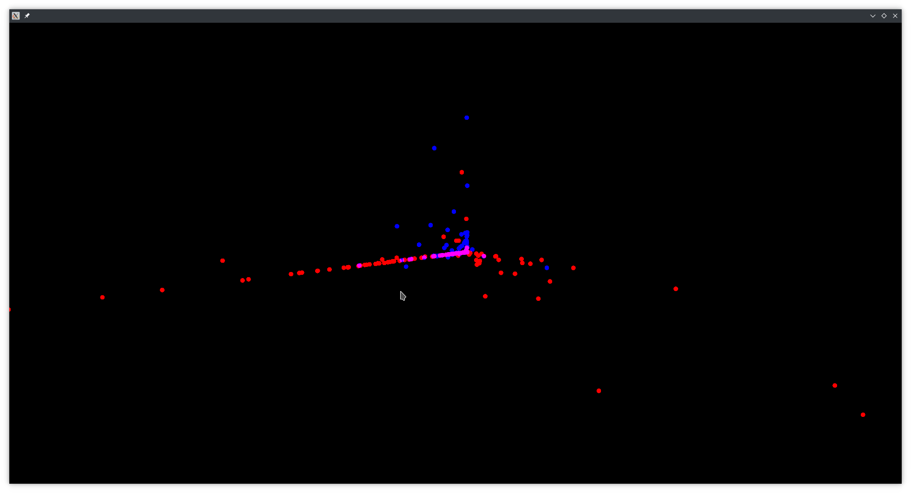

   ```
   {
       "precision": 0.39325842696629215,
       "recall": 1.0,
       "f1_score": 0.564516129032258
   }
   {
       "precision": 0.6395348837209303,
       "recall": 0.9821428571428571,
       "f1_score": 0.7746478873239436
   }
   {
       "precision": 0.6,
       "recall": 0.875,
       "f1_score": 0.711864406779661
   }
   {
       "precision": 0.4186046511627907,
       "recall": 1.0,
       "f1_score": 0.5901639344262295
   }
   {
       "precision": 0.5131578947368421,
       "recall": 0.8478260869565217,
       "f1_score": 0.639344262295082
   }
   ```

2. NearMiss

   version=1

   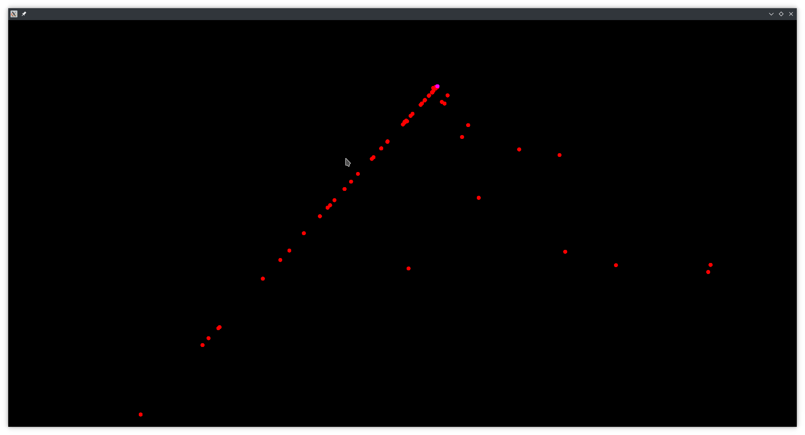

   ```
   {
       "precision": 0.5056179775280899,
       "recall": 1.0,
       "f1_score": 0.6716417910447761
   }
   {
       "precision": 0.4943820224719101,
       "recall": 1.0,
       "f1_score": 0.6616541353383459
   }
   {
       "precision": 0.4659090909090909,
       "recall": 1.0,
       "f1_score": 0.6356589147286822
   }
   {
       "precision": 1.0,
       "recall": 0.6304347826086957,
       "f1_score": 0.7733333333333333
   }
   {
       "precision": 0.5113636363636364,
       "recall": 1.0,
       "f1_score": 0.6766917293233083
   }
   ```

version=2

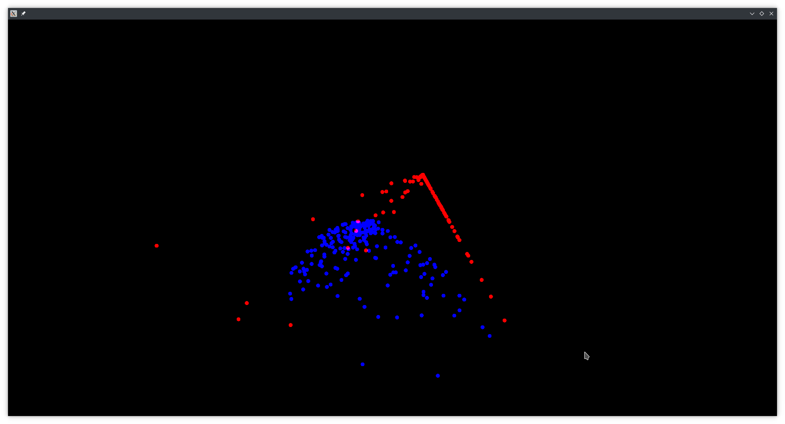

```
{
    "precision": 0.88,
    "recall": 1.0,
    "f1_score": 0.9361702127659575
}
{
    "precision": 0.9074074074074074,
    "recall": 0.9607843137254902,
    "f1_score": 0.9333333333333333
}
{
    "precision": 0.9512195121951219,
    "recall": 0.975,
    "f1_score": 0.9629629629629629
}
{
    "precision": 0.6612903225806451,
    "recall": 1.0,
    "f1_score": 0.7961165048543689
}
{
    "precision": 0.9777777777777777,
    "recall": 0.9777777777777777,
    "f1_score": 0.9777777777777777
}

```

version=3 （耗时较长）

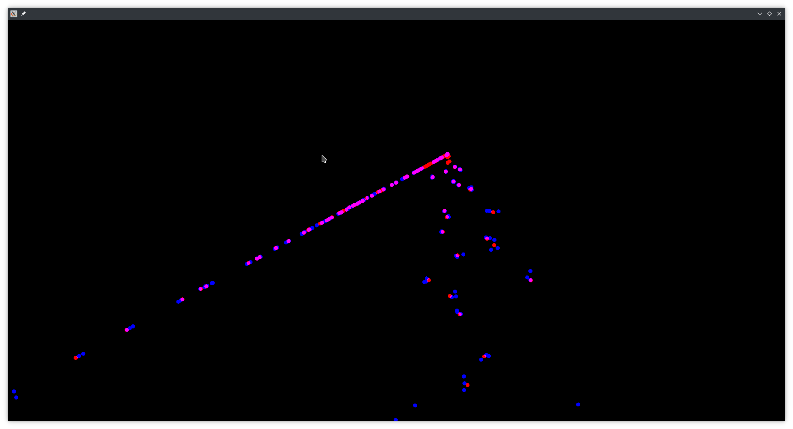

三、上采样和下采样结合

1. TomekLinks (耗时非常长)

   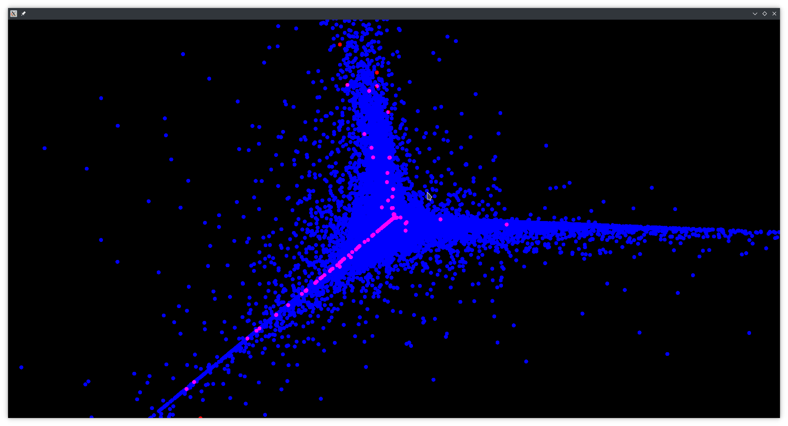


# 五、模型选择

使用随机搜索或者网格搜索确定最佳超参数。

需要确定的参数有：class_weight(用于cost-learning)，degree(升维)

# 六、异常检测

1. 高斯异常检测

   roc曲线：

   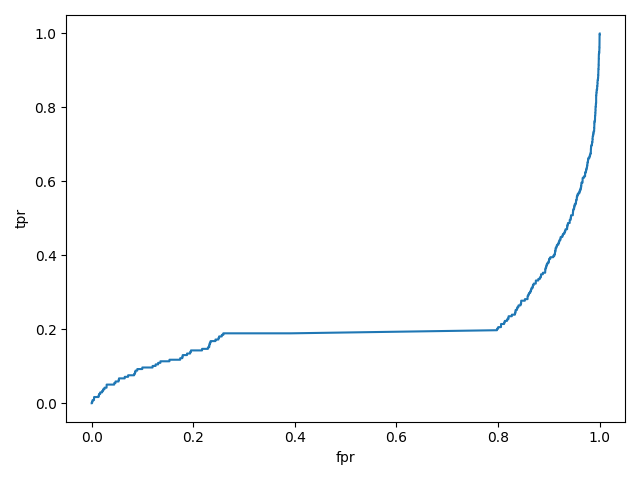

   auc :0.214

   推测原因：数据符合长尾分布

   ​         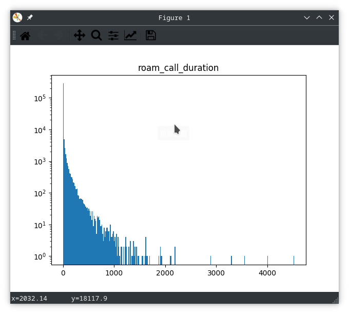	

   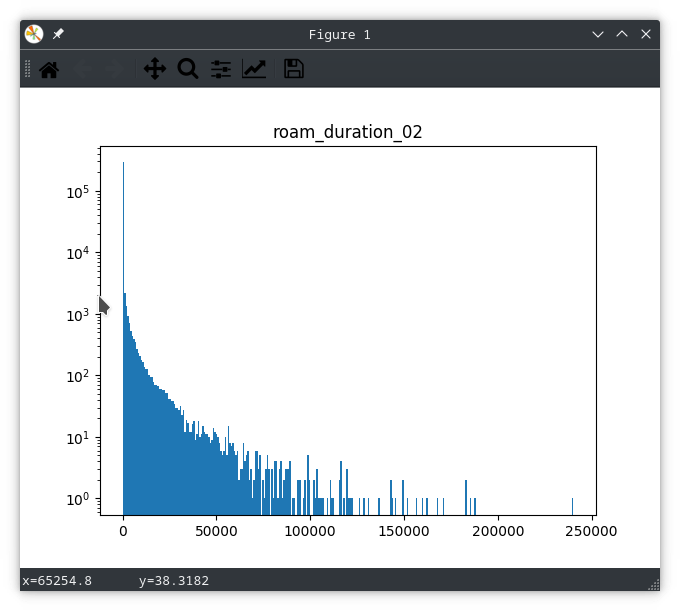

   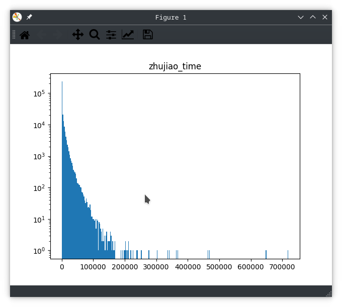

   ​				

   